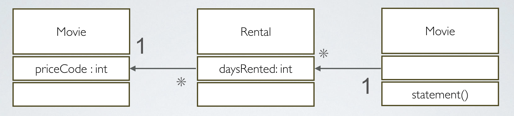
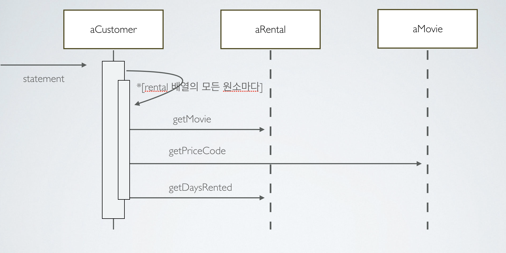
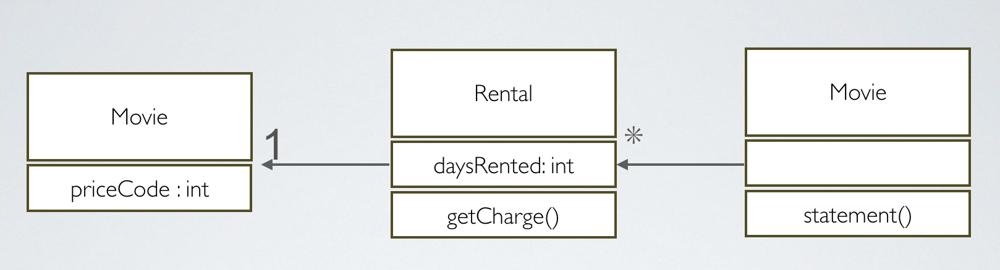

## Chapter 1 Martin Fowler's Refactoring Code

### 시작하기 전에... 모든 예제는 원문 그대로의 Java 코드를 통해 먼저 구현한 후, Python 코드로 다시 한번 복습하는 방식으로 진행할 것이다.

### Before Start... Every Examples are going to test with Java, and Second time I will practice with Python3.

### 1단원 맛보기 예제

### Chapter 1 Hello World Example

#### 맛보기 예제는 단순한 비디오 대여점에서 고객의 대여료 내역을 계산하고 출력하는 프로그램이다.
#### Hello World Example is a simple program that calculate and print the video rental fees.

클래스 간의 관계를 나타낸 다이어그램

Diagram that shows Class's relationship

</img>

Statement 메소드의 호출관계

Statement Method's  Diagram

</img>

맛보기 예제의 프로그램은 간단하고 오류도 없이 실행되기는 하지만 , 엉망진창난 코드라고 한다. 너무 깔끔하지 않고,  만약 
HTML로 출력되길 원한다고 가정한다면 statement 메서드의 어느 기능도 HTML내역 출력에 재사용이 불가능하다.
그렇다면 어떻게 코드를 수정해야될까 ?!

Hello World example is quite simple and haven't any errors, but it is not clean and obviously it is trash code 
insight of 'Code Refactoring'. So what should we do ?

> 변수의 활용이 중요한 것 같다. 메소드 안에서의 변수가 수정되어지지 않는다면 이를 매개변수로 사용할 수 있고, 변화하는 값은 사용하지 않는다. 
 
 
바뀌기 전의 코드  

<pre>
import java.util.Enumeration;
import java.util.Vector;

public class Customer {
    private String _name;
    private Vector _rentals = new Vector();

    public Customer(String name){
        _name = name;
    }
    public void addRental(Rental arg){
        _rentals.addElement(arg);

    }
    public String getName(){
        return _name;
    }

    // Before Refactoring Code
    public String statement() {
        double totalAmount = 0;
        int frequentRenterPoints = 0;
        Enumeration rentals = _rentals.elements();
        String result = getName() + " 고객님의 대여 기록 \n";

        while (rentals.hasMoreElements()) {
            double thisAmount = 0;
            Rental each = (Rental) rentals.nextElement();

            // 비디오의 종류별로 대여료 계산
            switch (each.getMovie().getPriceCode()) {
                case Movie.REGULAR:
                    thisAmount += 2;
                    if (each.getDaysRented() > 2)
                        thisAmount += (each.getDaysRented() - 2) * 1.5;
                    break;
                case Movie.NEW_RELEASE:
                    thisAmount += (each.getDaysRented()) * 3;
                    break;
                case Movie.CHILDERNS:
                    thisAmount += 1.5;
                    if (each.getDaysRented() > 3)
                        thisAmount += (each.getDaysRented() - 3) * 1.5;
                    break;
            }

            // 적립포인트를 1 포인트 증가
            frequentRenterPoints++;

            // 최신작을 2일 이상 대여할 경우 보넛 ㅡ포인트 지급
            if ((each.getMovie().getPriceCode() == Movie.NEW_RELEASE) && each.getDaysRented() > 1)
                frequentRenterPoints++;

            // 대여하는 비디오의 정보와 대여료를 출력

            result += '\t' + each.getMovie().getTitle() + '\t' + String.valueOf(thisAmount) + '\n';

            // 누적된 총 대여료
            totalAmount += thisAmount;
        }
        result += "누적 대여료 :" + String.valueOf(totalAmount)+'\n';
        result += "적립 포인트 :" + String.valueOf(frequentRenterPoints)+'\n';
        return result;
    }

}

</pre>

바뀐 후의 코드 

<pre>
import java.util.Enumeration;
import java.util.Vector;

public class Customer {
    private String _name;
    private Vector _rentals = new Vector();

    public Customer(String name){
        _name = name;
    }
    public void addRental(Rental arg){
        _rentals.addElement(arg);

    }
    public String getName(){
        return _name;
    }

    /* Before Refactoring Code
    public String statement() {
        double totalAmount = 0;
        int frequentRenterPoints = 0;
        Enumeration rentals = _rentals.elements();
        String result = getName() + " 고객님의 대여 기록 \n";

        while (rentals.hasMoreElements()) {
            double thisAmount = 0;
            Rental each = (Rental) rentals.nextElement();

            // 비디오의 종류별로 대여료 계산
            switch (each.getMovie().getPriceCode()) {
                case Movie.REGULAR:
                    thisAmount += 2;
                    if (each.getDaysRented() > 2)
                        thisAmount += (each.getDaysRented() - 2) * 1.5;
                    break;
                case Movie.NEW_RELEASE:
                    thisAmount += (each.getDaysRented()) * 3;
                    break;
                case Movie.CHILDERNS:
                    thisAmount += 1.5;
                    if (each.getDaysRented() > 3)
                        thisAmount += (each.getDaysRented() - 3) * 1.5;
                    break;
            }

            // 적립포인트를 1 포인트 증가
            frequentRenterPoints++;

            // 최신작을 2일 이상 대여할 경우 보넛 ㅡ포인트 지급
            if ((each.getMovie().getPriceCode() == Movie.NEW_RELEASE) && each.getDaysRented() > 1)
                frequentRenterPoints++;

            // 대여하는 비디오의 정보와 대여료를 출력

            result += '\t' + each.getMovie().getTitle() + '\t' + String.valueOf(thisAmount) + '\n';

            // 누적된 총 대여료
            totalAmount += thisAmount;
        }
        result += "누적 대여료 :" + String.valueOf(totalAmount)+'\n';
        result += "적립 포인트 :" + String.valueOf(frequentRenterPoints)+'\n';
        return result;
    }
     */

    public String statement(){
        double totalAmount =0;
        int frequentRenterPoints =0;
        Enumeration rentals = _rentals.elements();
        String result = getName()+ " 고객님의 대여 기록\n";

        while(rentals.hasMoreElements()){
            double thisAmount=0;
            Rental each = (Rental) rentals.nextElement();
            // 바뀐 부분
            thisAmount = amountFor(each);

            // 적립 포인트를 1 포인트 증가
            frequentRenterPoints++;
            // 최신물을 2일 이상 대여할 경우 보너스 포인트 지급
            if((each.getMovie().getPriceCode()  == Movie.NEW_RELEASE) && each.getDaysRented() >1)
                frequentRenterPoints++;

            // 대여하는 비디오의 정보와 대여료를 출력
            result += '\t'+each.getMovie().getTitle()+'\t'+String.valueOf(thisAmount)+'\n';
            totalAmount+=thisAmount;

        }
        result += "누적 대여료:" + String.valueOf(totalAmount)+'\n';
        result += "적립 포인트:" + String.valueOf(frequentRenterPoints);
        return result;
    }
    private double amountFor(Rental each){
        double thisAmount = 0;

        switch (each.getMovie().getPriceCode()){
            case Movie.REGULAR:
                thisAmount +=2;
                if(each.getDaysRented() >2 )
                    thisAmount+=(each.getDaysRented()-2)*1.5;
                break;
            case Movie.NEW_RELEASE:
                thisAmount+= each.getDaysRented() *3;
                break;
            case Movie.CHILDERNS:
                thisAmount+=1.5;
                if(each.getDaysRented() >3)
                    thisAmount+= (each.getDaysRented() -3)*1.5;
                break;
        }
        return thisAmount;
    }

}
</pre>

코드의 수정 전후를 살펴 보면 
> 1. 리펙토링 전에는 반드시 신뢰도 높은 Test Suites를 활용하여 테스팅한다.
> 1. 변수의 활용 즉, 불변하는 변수는 매개변수로 활용한다.
> 2. 프로그램을 단계적으로 조금씩 수정한다.
> 3. 부적절한 변수명의 교체, 실력있는 프로그래머라면 인간이 이해할 수 있는 코드를 작성한다. 컴퓨터가 아닌...
> 4. 불필요한 변수를 삭제, 즉 변수를 메소드 호출로 전환한다.
>

다음 으로는 대여료 계산 메소드를 옮긴다. 즉 Customer class 안에 있음에도 불구하고 customer class의 정보는 사용하지 않음으로, 
이를 실질적인 데이터를 활용하는 Rental class로 이동한다.

Change Method를 옮긴 후 클래스 관계의 변화이다.

</img>

이 후, 수정할 부분은 thisAmount의 변수를 수정할 것 인데, 이는 불필요한 중복이 있기 때문이다. thisAmount의 변수는 each.charge
메서드의 결과를 저장하는데만 사용하고, 그 후에는 전혀 사용되지 않기 때문이다.

statement()의 수정.

<pre>

public String statement(){
    double totalAmount =0;
    int frequentRenterPoints =0;
    Enumeration rentals = _rentals.elements();
    String result = getName()+ " 고객님의 대여 기록\n";

    while(rentals.hasMoreElements()){
        // #3 불필요한 변수의 제거
        //double thisAmount=0;
        Rental each = (Rental) rentals.nextElement();
        // 바뀐 부분 #1
        // thisAmount = amountFor(each);
        // 재수정 #2
        // #3 불필요한 변수를 제거한다.
        // thisAmount = each.getCharge();

        // 적립 포인트를 1 포인트 증가
        frequentRenterPoints++;
        // 최신물을 2일 이상 대여할 경우 보너스 포인트 지급
        if((each.getMovie().getPriceCode()  == Movie.NEW_RELEASE) && each.getDaysRented() >1)
            frequentRenterPoints++;

        // 대여하는 비디오의 정보와 대여료를 출력
        result += '\t'+each.getMovie().getTitle()+'\t'+String.valueOf(each.getCharge())+'\n';
        totalAmount+=each.getCharge();

    }
    result += "누적 대여료:" + String.valueOf(totalAmount)+'\n';
    result += "적립 포인트:" + String.valueOf(frequentRenterPoints);
    return result;
}

</pre>

44p부터  